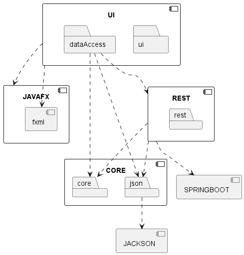
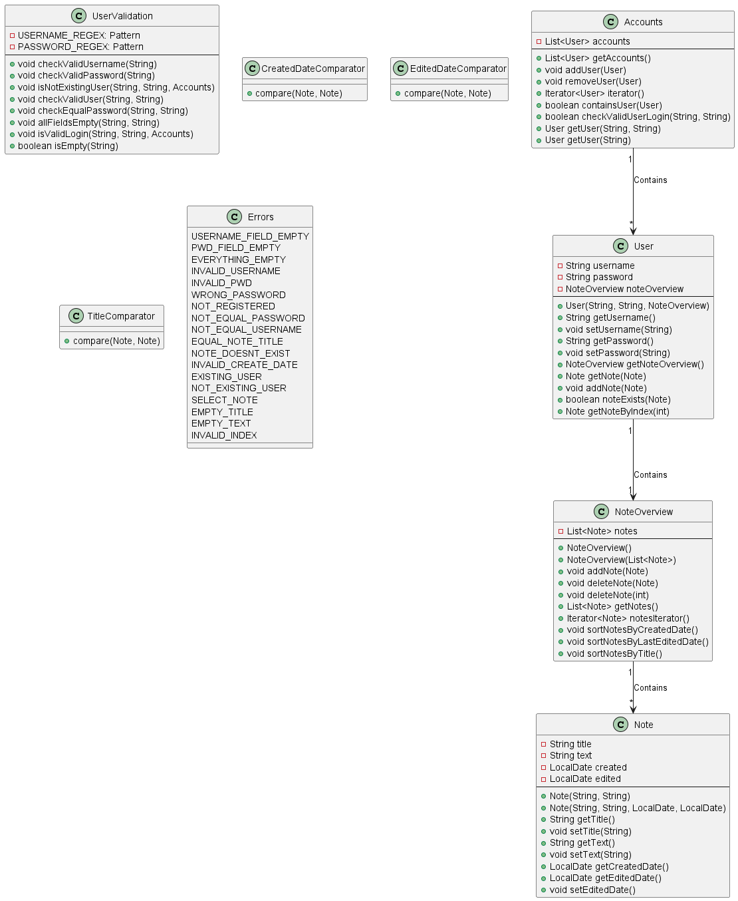
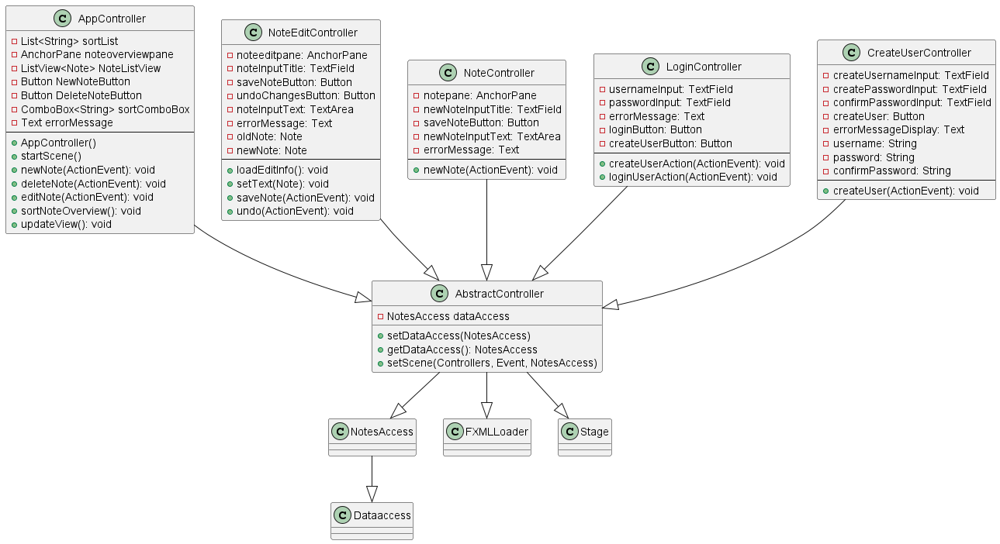
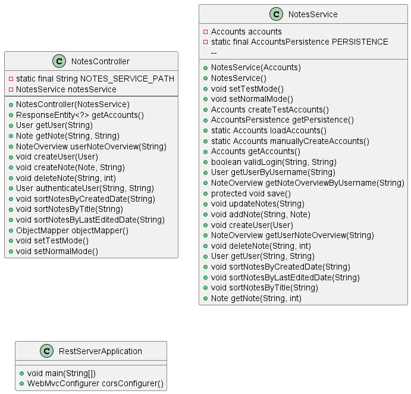
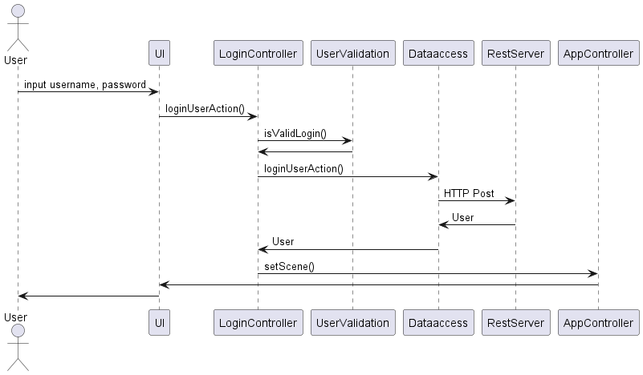

# Diagrams

### Architecture - package diagram:

### Class diagram for core: 

### Class diagram for controllers:

### Class diagram for rest module:

### Sequence diagram for when user logs in:
